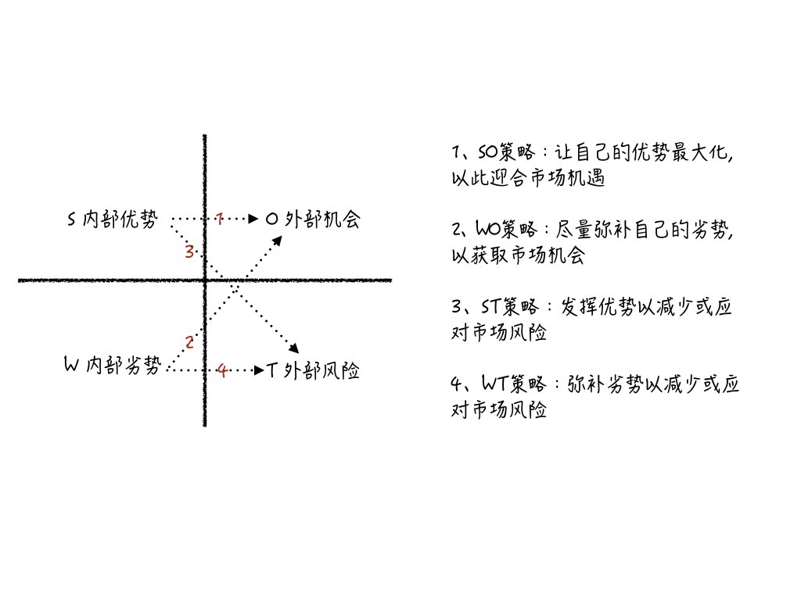

# 产品战略/行业竞品调研/落地方案
在产品战略规划时，免不了进行行业和相关竞品的调研，其中常见的方法是已经被提及无数次的SWOT分析。昨天听了一堂课，加深并修正了我的SWOT的认知和应用。
我们都知道S代表优势、W代表劣势、O代表市场机会、T代表市场风险。可是这四者之间有什么关系呢？列举了这四个方面后，我们又怎么将分析结果落地呢？

如图，S、W对应自己，O、T对应环境，我们分析总结这四个方面后，一个有效的执行方案，就是决定如何用自己的S、W去匹配环境的O、T，并且这应当)表现为一个长期的发展计划。
